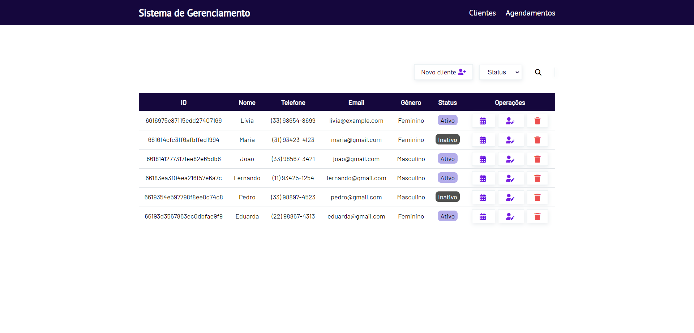

# Sistema de Gerenciamento para Academias

## Conteúdos

- [Visão Geral](#visão-geral)
- [API Endpoints](#api-endpoints)
- [Recursos](#recursos)
- [Vantagens do Node.js](#vantagens-do-nodejs)

## Visão Geral 

Esse sistema de gerenciamento para academias permite aos usuários realizar operações, como gerenciar informações de clientes e gerenciar agendamentos de clientes em aulas coletivas. Ele oferece uma interface intuitiva e fácil de usar para administrar as atividades relacionadas à academia.

<h1 align="center">
    
    
    
    
    
    
</h1>

## API Endpoints 

### API Cliente
- GET /api/clients: Retorna todos os clientes cadastrados.
- GET /api/clients/:id: Retorna um cliente específico com o ID fornecido.
- GET /api/clients/name/:name: Retorna um cliente com o nome fornecido.
- GET /api/clients/status/:status: Retorna clientes com o status fornecido.
- POST /api/clients: Cria um novo cliente.
- PUT /api/clients/:id: Atualiza os dados de um cliente existente.
- DELETE /api/clients/:id: Exclui um cliente com o ID fornecido.

### API Agendamentos
- GET /api/agendamentos/:id: Retorna um agendamento específico com o ID fornecido.
- GET /api/agendamentos: Retorna todos os agendamentos.
- GET /api/agendamentos/aula/:aula: Retorna agendamentos para uma aula específica.
- GET /api/agendamentos/clientes/:clientId: Retorna agendamentos para um cliente específico.
- GET /api/agendamentos/cliente/:name: Retorna agendamentos para um cliente com o nome fornecido.
- GET /api/agendamentos/confirmacao/:status: Retorna agendamentos com o status  fornecido.
- POST /api/agendamentos: Cria um novo agendamento.
- PUT /api/agendamentos/:id: Atualiza os dados de um agendamento existente.
- DELETE /api/agendamentos/:id: Exclui um agendamento com o ID fornecido.

## Recursos

### Construído com

- Core
  - [node.js](https://nodejs.org/en/docs/) - uma plataforma de ambiente de execução JavaScript construída no motor V8 JavaScript do Chrome.

- Framework web
  - [express](https://expressjs.com) - Framework web rápido e minimalista para Node.js.

- Banco de dados
   - [mongoDB](https://www.mongodb.com/docs/manual/) - um poderoso sistema de banco de dados orientado a documentos, valorizado por sua flexibilidade e escalabilidade.

## Vantagens do Node.js

- Flexível
- Leve
- Alta escalabilidade
- Redução de custos
- Maior repositório do mundo - NPM
- Mesma linguagem no frontend e backend
