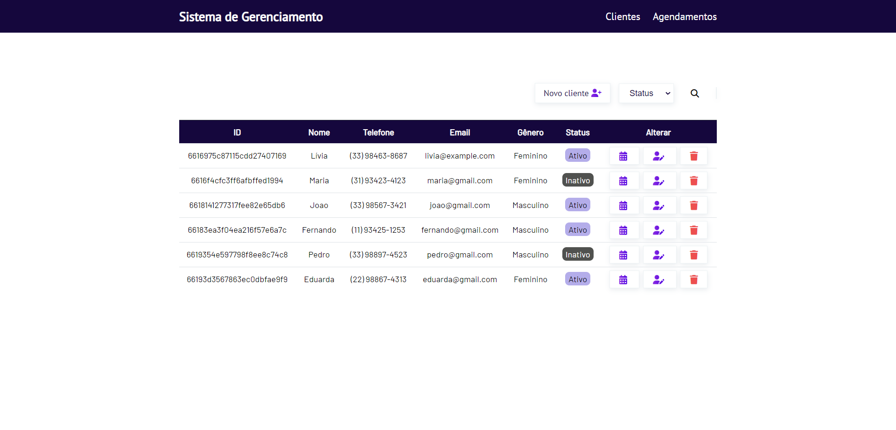
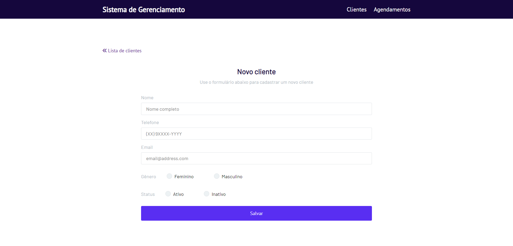
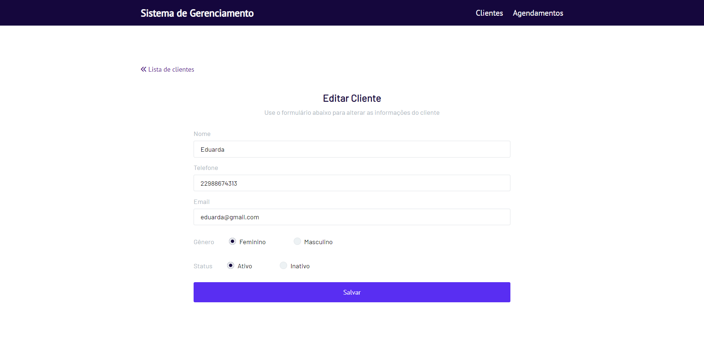
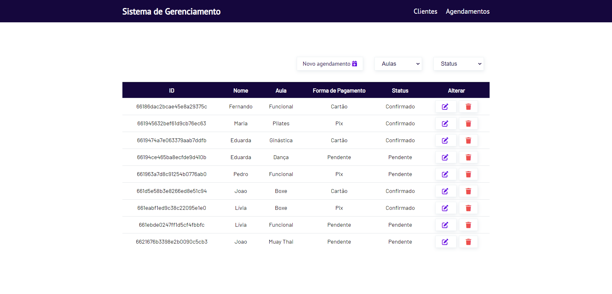
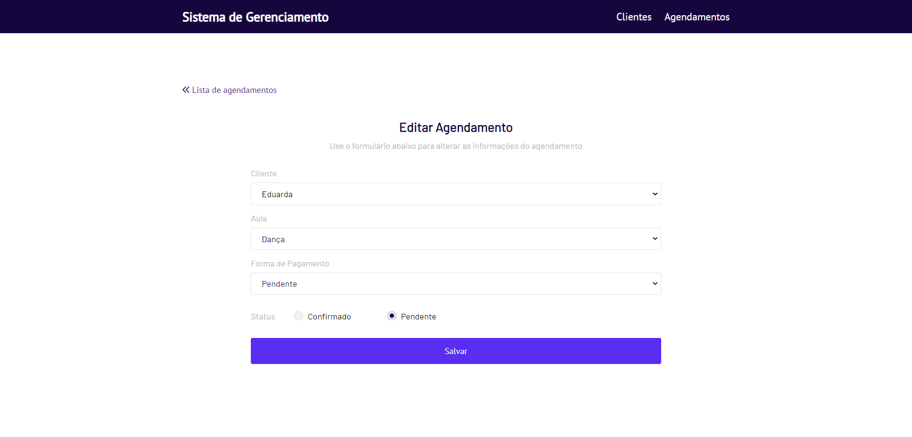

# Sistema de Gerenciamento para academias

## Conteúdos

- [Visão Geral](#visao-geral)
- [API Endpoints](#api)
- [O que é o Node.js?](#node)
- [Modelo de Processo do Node.js](#modelo)
- [Como o Node.js funciona?](#funciona)
- [Arquitetura - Node.js](#arquitetura)
- [Vantagens](#vantagens)
- [O que é o V8 do Chrome?](#v8)
- [Por que o LIBUV é necessário no Node.js?](#libuv)

## Visão Geral 

Este sistema de gerenciamento para academias permite aos usuários realizar operações, como gerenciar informações de clientes e gerenciar agendamentos de clientes em aulas coletivas. Ele oferece uma interface intuitiva e fácil de usar para administrar as atividades relacionadas à academia.

<h1 align="center">
    
    
    
    
    
    
</h1>

## API Endpoints 

### API Cliente
- GET /api/clients: Retorna todos os clientes cadastrados.
- GET /api/clients/:id: Retorna um cliente específico com o ID fornecido.
- GET /api/clients/name/:name: Retorna um cliente com o nome fornecido.
- GET /api/clients/status/:status: Retorna clientes com o status fornecido.
- POST /api/clients: Cria um novo cliente.
- PUT /api/clients/:id: Atualiza os dados de um cliente existente.
- DELETE /api/clients/:id: Exclui um cliente com o ID fornecido.

### API Agendamentos
- GET /api/agendamentos/:id: Retorna um agendamento específico com o ID fornecido.
- GET /api/agendamentos: Retorna todos os agendamentos.
- GET /api/agendamentos/aula/:aula: Retorna agendamentos para uma aula específica.
- GET /api/agendamentos/clientes/:clientId: Retorna agendamentos para um cliente específico.
- GET /api/agendamentos/cliente/:name: Retorna agendamentos para um cliente com o nome fornecido.
- GET /api/agendamentos/confirmacao/:status: Retorna agendamentos com o status  fornecido.
- POST /api/agendamentos: Cria um novo agendamento.
- PUT /api/agendamentos/:id: Atualiza os dados de um agendamento existente.
- DELETE /api/agendamentos/:id: Exclui um agendamento com o ID fornecido.

## O que é o Node.js? 

Node.js é um ambiente de execução de código aberto no lado do servidor, construído no motor JavaScript V8 do Chrome. Ele fornece um ambiente de tempo de execução multiplataforma e orientado a eventos, de I/O não bloqueante (assíncrono), para construir aplicativos altamente escaláveis no lado do servidor usando JavaScript.

## Modelo de Processo do Node.js 

O Node.js é executado em um único processo e o código do aplicativo é executado em uma única thread, o que requer menos recursos do que outras plataformas. Todas as solicitações do usuário para a sua aplicação web serão tratadas por uma única thread e todo o trabalho de I/O ou tarefas demoradas é executado de forma assíncrona para uma solicitação específica. Portanto, essa única thread não precisa esperar pela conclusão da solicitação e está livre para lidar com a próxima solicitação. Quando o trabalho de I/O assíncrono é concluído, ele processa a solicitação e envia a resposta.

## Como o Node.js funciona? 

Uma aplicação Node.js cria uma single-thread ao ser executado. Sempre que o Node.js recebe uma solicitação, ele primeiro a conclui antes de passar para a próxima solicitação.

O Node.js funciona de forma assíncrona usando o Event Loop e funções de callback para lidar com várias solicitações que chegam em paralelo. O Event Loop é uma funcionalidade que lida e processa todos os eventos externos e os converte em uma função de callback. Ele invoca todos os manipuladores de eventos no momento adequado. Assim, muitos processos são realizados nos bastidores durante o processamento de uma única solicitação, para que a nova solicitação que chega não precise esperar se o processamento não estiver concluído.

Ao processar uma solicitação, o Node.js anexa uma função de callback a ela e a move para o back-end. Agora, sempre que a resposta estiver pronta, um evento é chamado, o que aciona a função de callback associada para enviar essa resposta.

## Arquitetura - Node.js

Uma aplicação Node.js cria uma única thread ao ser invocada. Basicamente, o servidor consiste em uma única thread processando um evento após o outro.

Uma nova solicitação que chega é um tipo de evento. O servidor começa a processá-la e, quando há uma operação de I/O bloqueante, ele não espera até que seja concluída e, em vez disso, registra uma função de callback. O servidor então imediatamente começa a processar outro evento (talvez outra solicitação). Quando a operação de I/O é concluída, isso é outro tipo de evento, e o servidor irá processá-lo (ou seja, continuar trabalhando na solicitação) executando a função de callback assim que tiver tempo.

A plataforma Node.js não segue o modelo de requisição/resposta multi-threaded stateless model. Ela segue o modelo de single-thread com Event Loop. O modelo de processamento do Node.js é baseado principalmente no modelo de eventos do JavaScript com mecanismo de callback em JavaScript.

<h1 align="center">
    
</h1>

Passos de processamento do modelo de Event Loop com single-thread:

1. Os clientes enviam uma solicitação ao servidor web.
2. O servidor web do Node.js mantém internamente um pool de threads limitado para fornecer serviços às solicitações dos clientes.
3. O servidor web do Node.js recebe essas solicitações e as coloca em uma fila. Isso é conhecido como Event Queue.
4. O servidor web do Node.js internamente possui um componente chamado Event Loop. Ele recebe as solicitações e as processa usando um loop indefinido.
5. O Event Loop usa apenas uma thread. É o coração do modelo de processamento da plataforma Node.js.
6. O Event Loop verifica se há alguma solicitação de cliente na fila de eventos(Event Queue). Se não houver, ele aguarda indefinidamente a chegada de solicitações.
7. Se houver, ele pega uma solicitação do cliente da fila de eventos(Event Queue).
   - Inicia o processamento desta solicitação do cliente.
   - Se a solicitação do cliente não exigir nenhuma operação de I/O bloqueante, processa tudo, prepara a resposta e a envia de volta para o cliente.
   - Se a solicitação do cliente exigir alguma operação de I/O bloqueante, como interagir com o banco de dados, sistema de arquivos, serviços externos, ele seguirá uma abordagem diferente.
     - Verifica a disponibilidade de threads no pool de threads interno.
     - Pega uma thread e atribui essa solicitação do cliente a essa thread.
     - Essa thread é responsável por receber a solicitação, processá-la, executar as operações de I/O bloqueante, preparar a resposta e enviá-la de volta para o Event Loop.
     - O Event Loop, por sua vez, envia essa resposta para o respectivo cliente.

## O que é o V8 do Chrome? 

O V8 é um mecanismo JavaScript de código aberto criado em C++ desenvolvido pelo Google. Foi originalmente projetado para o Google Chrome e navegadores baseados no Chromium (como o Brave) em 2008, mas posteriormente foi utilizado para criar o Node.js para codificação no lado do servidor.

Ele analisa e executa o código JavaScript. O DOM e outras Web Platform APIs (que compõem o ambiente de tempo de execução) são fornecidos pelo navegador.

O V8 é conhecido como um mecanismo JavaScript porque ele recebe código JavaScript e o executa durante a navegação no Chrome. Ele fornece um ambiente de tempo de execução para a execução de código JavaScript. A melhor parte é que o mecanismo JavaScript é completamente independente do navegador em que é executado.

## Por que o LIBUV é necessário no Node.js?

O libuv é uma biblioteca em C originalmente escrita para o Node.js, para abstrair operações de I/O não bloqueantes. Ele oferece os seguintes recursos:

- Permite que a CPU e outros recursos sejam usados simultaneamente enquanto ainda realiza operações de I/O, resultando assim em uma utilização eficiente de recursos e rede.
- Facilita uma abordagem orientada a eventos em que I/O e outras atividades são realizadas usando notificações baseadas em callbacks.
- Fornece mecanismos para lidar com sistema de arquivos, DNS, rede, processos filhos, pipes, manipulação de sinais, sondagem e streaming.
- Também inclui um pool de threads para transferir o trabalho para algumas coisas que não podem ser feitas de forma assíncrona no nível do sistema operacional.

## Vantagens do Node.js

- Flexível
- Leve
- Alta escalabilidade
- Redução de custos
- Maior repositório do mundo - NPM
- Mesma linguagem no frontend e backend